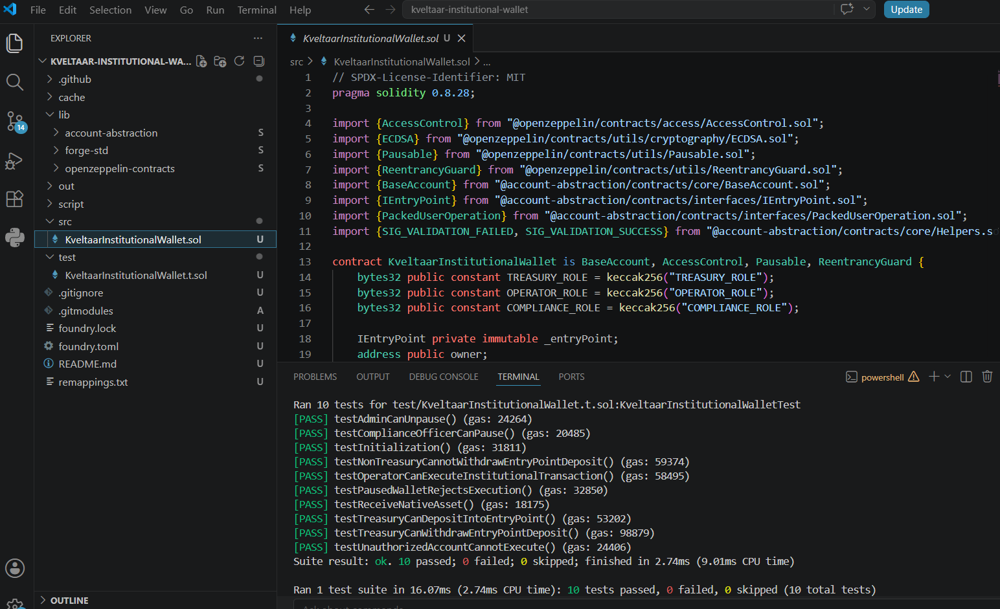
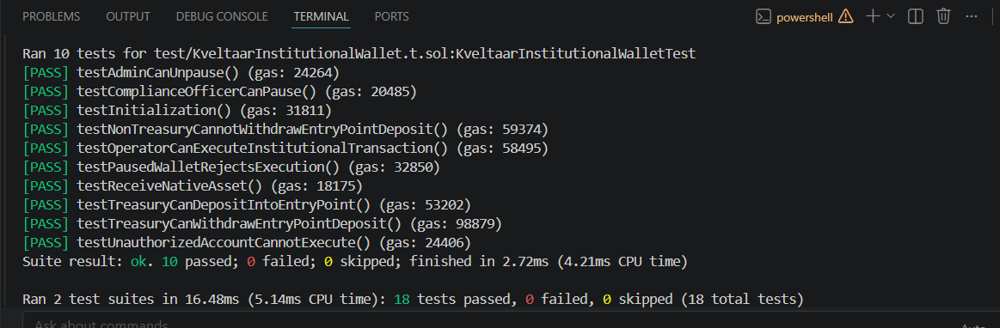

<p align="center">
  <h1 align="center">Kveltaar Institutional Wallet</h1>
  <p align="center">
    Enterprise-grade ERC-4337 Smart Account for Institutional Digital Asset Management
  </p>
</p>

<p align="center">


</p>
<p align="left">


</p>

---

# Executive Summary

Kveltaar Institutional Wallet is a modular ERC-4337 smart account architecture designed for institutional blockchain applications requiring deterministic deployment, role-based governance, treasury separation and secure transaction execution.

The project combines Account Abstraction, CREATE2 deployment, OpenZeppelin security primitives and an extensive automated testing pipeline built with Foundry.

The implementation follows a security-first engineering approach and demonstrates production-oriented smart contract architecture suitable for regulated blockchain environments.

---

# Highlights

- ERC-4337 Account Abstraction
- CREATE2 deterministic wallet deployment
- Institutional Wallet Factory
- Role-Based Access Control (RBAC)
- Treasury Management
- Compliance Role
- Operator Role
- Emergency Pause Mechanism
- Reentrancy Protection
- EntryPoint Deposit Management
- Fully Tested using Foundry
- Static Analysis with Slither
- Verified Contracts on Sepolia
- GitHub Actions Continuous Integration

---

# Architecture

```text
                                      ERC-4337 Bundler
                                             │
                                             │ UserOperation
                                             ▼
                                  ┌───────────────────────┐
                                  │      EntryPoint       │
                                  │        v0.9           │
                                  └───────────┬───────────┘
                                              │
                     ┌────────────────────────┴────────────────────────┐
                     │                                                 │
                     │ Account deployment path                         │ Validation and execution path
                     │                                                 │
                     │ initCode / factory call                         │ validateUserOp()
                     ▼                                                 ▼
          ┌──────────────────────────────┐              ┌─────────────────────────────────────┐
          │   KveltaarWalletFactory      │              │ KveltaarInstitutionalWallet         │
          │                              │              │                                     │
          │ • CREATE2 deployment         │─────────────▶│ • ERC-4337 validation               │
          │ • Deterministic address      │              │ • Owner signature verification      │
          │ • Wallet provisioning        │              │ • RBAC                              │
          └──────────────────────────────┘              │ • Treasury controls                 │
                                                        │ • Operator execution                 │
                                                        │ • Compliance pause controls          │
                                                        │ • EntryPoint deposit management      │
                                                        │ • Reentrancy protection              │
                                                        └──────────────────┬──────────────────┘
                                                                           │
                                                                           │ execute()
                                                                           ▼
                                                        ┌─────────────────────────────────────┐
                                                        │ External contracts and asset flows  │
                                                        │ on Ethereum Sepolia                 │
                                                        └─────────────────────────────────────┘

---

# Repository Structure

```text
.
├── docs/
│   └── images/
├── script/
├── src/
├── test/
├── lib/
├── foundry.toml
├── remappings.txt
├── SECURITY.md
├── LICENSE
└── README.md
```

---

# Execution Flow

The architecture supports two independent operational paths within the ERC-4337 lifecycle.

## Initial Wallet Deployment (Counterfactual Deployment)

1. A Bundler submits a `UserOperation` containing deployment information.
2. The ERC-4337 `EntryPoint` invokes `KveltaarWalletFactory`.
3. The factory deploys a new `KveltaarInstitutionalWallet` using **CREATE2**, ensuring a deterministic wallet address.
4. After deployment, the `EntryPoint` immediately invokes `validateUserOp()` on the newly created wallet.
5. Once validation succeeds, the requested operation is executed.

---

## Existing Wallet Execution

1. A Bundler submits a `UserOperation` for an already deployed wallet.
2. The ERC-4337 `EntryPoint` calls `validateUserOp()` directly on `KveltaarInstitutionalWallet`.
3. The wallet verifies the owner's authorization and enforces all institutional security controls.
4. Access control, treasury restrictions, pause state and execution permissions are evaluated.
5. Upon successful validation, the requested transaction is executed.

---

# Core Components

## Kveltaar Institutional Wallet

The wallet implements an institutional account architecture built around ERC-4337 Account Abstraction.

Main responsibilities include:

- Account ownership
- Role-based authorization
- Treasury management
- Secure transaction execution
- Native asset handling
- EntryPoint interaction
- Emergency pause functionality

---

## Kveltaar Wallet Factory

The factory provides deterministic CREATE2 deployment allowing institutional systems to pre-compute wallet addresses before deployment.

Benefits include:

- Predictable wallet addresses
- Gas-efficient deployment
- Deterministic infrastructure
- Enterprise provisioning workflow

---

# Security Architecture

The wallet follows a defense-in-depth approach based on established OpenZeppelin security primitives and institutional operational separation.

## Access Control

Four independent roles are implemented:

| Role | Responsibility |
|------|----------------|
| Default Admin | Administrative governance |
| Treasury | Treasury operations |
| Operator | Transaction execution |
| Compliance | Operational compliance |

This separation minimizes operational risk while supporting institutional governance workflows.

---

## Security Controls

The implementation includes multiple security mechanisms:

- Role-Based Access Control (RBAC)
- OpenZeppelin AccessControl
- ReentrancyGuard
- Emergency Pause
- Secure native asset transfers
- Controlled external execution
- EntryPoint validation
- Treasury isolation
- Deterministic CREATE2 deployment

---

# Verified Smart Contracts

## Sepolia Testnet

### Kveltaar Wallet Factory

**Address**

`0xF77Cc2F14D6B2C9E3c19345F5A7f3E791D7445F6`

**Etherscan**

https://sepolia.etherscan.io/address/0xF77Cc2F14D6B2C9E3c19345F5A7f3E791D7445F6

Verified Source Code

---

### Kveltaar Institutional Wallet

**Address**

`0xea3e3D9bc728421367e2D63283B7F2aB6957fbE2`

**Etherscan**

https://sepolia.etherscan.io/address/0xea3e3D9bc728421367e2D63283B7F2aB6957fbE2

Verified Source Code

---

# Testing Strategy

The project follows a comprehensive automated testing approach using Foundry.

The test suite validates both expected execution paths and failure scenarios.

Covered functionality includes:

- Wallet deployment
- Factory deployment
- CREATE2 deterministic addresses
- Role initialization
- Treasury permissions
- Operator permissions
- Compliance permissions
- EntryPoint integration
- Native asset handling
- Access control
- Unauthorized execution rejection
- Administrative controls
- Wallet creation
- Deterministic deployment
- Failure handling
- Permission enforcement

---

# Development Environment

The following screenshot shows the development environment together with the automated Foundry test execution.

<p align="center">

</p>

---

# Automated Test Results

The complete Foundry test suite executes successfully.

<p align="center">

</p>

```
18 tests passed
0 failed
0 skipped
```

The current implementation successfully passes all automated unit tests.

---

# Static Security Analysis

Static analysis is performed using **Slither**.

The analysis focuses on:

- Access control
- Dangerous external calls
- Reentrancy
- State variable analysis
- Gas optimizations
- Solidity best practices

The reported findings consist of informational observations and optimization opportunities that were reviewed during development.

---

# Continuous Integration

The repository includes GitHub Actions workflows providing automated verification for every commit.

Current pipeline:

- Solidity compilation
- Formatting verification
- Foundry build
- Complete test execution
- Static analysis with Slither

This ensures reproducible builds and continuous validation throughout the development lifecycle.

---

# Getting Started

## Clone the Repository

```bash
git clone https://github.com/BlockchainInes/kveltaar-institutional-wallet.git

cd kveltaar-institutional-wallet
```

---

## Install Dependencies

```bash
forge install
```

---

## Build

Compile the complete project:

```bash
forge build
```

---

## Run Tests

Execute the complete automated test suite.

```bash
forge test -vvv
```

---

## Code Formatting

Verify formatting.

```bash
forge fmt --check
```

---

## Static Analysis

Run Slither.

```bash
slither .
```

---

# Design Principles

The project was designed following several engineering principles commonly adopted in professional smart contract development.

### Security First

Security considerations are integrated into the architecture rather than added afterwards.

### Least Privilege

Operational permissions are separated through dedicated roles to reduce unnecessary authority.

### Deterministic Infrastructure

Wallet deployment uses CREATE2 to allow deterministic address generation before deployment.

### Modular Architecture

Wallet provisioning and wallet execution are separated into dedicated contracts.

### Testability

The implementation is accompanied by a comprehensive automated test suite built with Foundry.

### Maintainability

The codebase emphasizes readability, modularity and explicit authorization boundaries.

---

# Project Goals

The project demonstrates an institutional implementation of an ERC-4337 smart account architecture featuring:

- Account Abstraction
- Deterministic Wallet Deployment
- Role-Based Governance
- Treasury Separation
- Secure Transaction Execution
- Automated Testing
- Static Security Analysis
- Continuous Integration

---

# Future Enhancements

Planned areas for future development include:

- Multi-signature governance
- Session Keys
- Spending policies
- Daily treasury limits
- Time-locked administrative operations
- ERC-1271 signature validation
- EIP-712 structured approvals
- Account recovery mechanisms
- Modular execution plugins
- Cross-chain wallet provisioning

---

# Professional Tooling

Development workflow includes:

- Foundry
- Forge
- OpenZeppelin Contracts
- ERC-4337 EntryPoint
- Slither
- GitHub Actions
- Solidity 0.8.28

---

# Repository Contents

```
docs/
images/
script/
src/
test/
lib/

README.md
LICENSE
SECURITY.md
foundry.toml
```

---

# Disclaimer

This repository demonstrates an institutional ERC-4337 wallet architecture intended for portfolio and technical evaluation purposes.

The contracts have been verified on the Sepolia test network and are supported by automated tests and static analysis.

Use in production environments should be preceded by an independent professional security audit and project-specific risk assessment.

---

# License

Released under the MIT License.

---

# Author

**Ines Krüger**

Blockchain Engineer

GitHub

https://github.com/BlockchainInes

---

If this repository is useful, consider giving it a ⭐.


